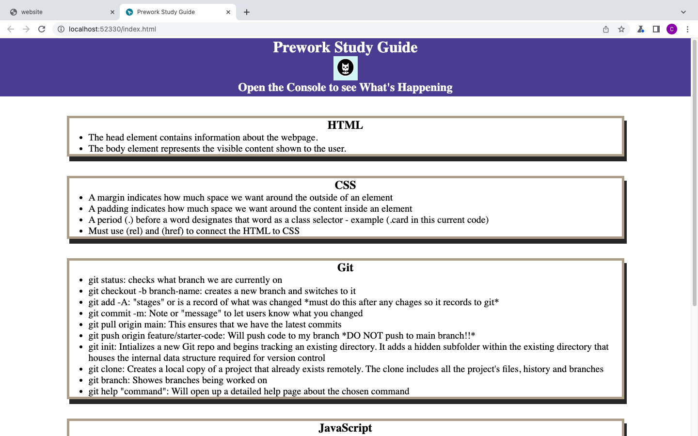

# prework-study-guide
A study guide for course pre-work 
# <Chris' Prework Study Guide>

## Description

Provide a short description explaining the what, why, and how of your project. Use the following questions as a guide:

- Motivation:  To provide myself as well as others a resorce for notes taken in class while learning.
This project was built becasue I beleive that taking and keeping good notes while learning a new skill is incredibly importaint 
This page solves the issue of not having an organized and consise place to keep notes while learning.
I learned many skills during this project.  Through using Git/GitHub to create a repository to keep and save my work as I move through it to basics of HTML, CSS and JavaScript.

## Installation

Simply type or copy/paste the following URL and it will bring you to my page:  https://crnaro.github.io/prework-study-guide/

## Usage

Provide instructions and examples for use. Include screenshots as needed.

To add a screenshot, create an `assets/images` folder in your repository and upload your screenshot to it. Then, using the relative file path, add it to your README using the following syntax:

  

## Credits

List your collaborators, if any, with links to their GitHub profiles.

Some code used in collaboration with UNH Bootcamp 

If you followed tutorials, include links to those here as well.

Link to tutorials used : (https://bootcampspot.instructure.com/courses/4422/modules)

## License

---MIT License

Copyright (c) [2023] [Christopher Robert Naro]

Permission is hereby granted, free of charge, to any person obtaining a copy
of this software and associated documentation files (the "Software"), to deal
in the Software without restriction, including without limitation the rights
to use, copy, modify, merge, publish, distribute, sublicense, and/or sell
copies of the Software, and to permit persons to whom the Software is
furnished to do so, subject to the following conditions:

The above copyright notice and this permission notice shall be included in all
copies or substantial portions of the Software.

THE SOFTWARE IS PROVIDED "AS IS", WITHOUT WARRANTY OF ANY KIND, EXPRESS OR
IMPLIED, INCLUDING BUT NOT LIMITED TO THE WARRANTIES OF MERCHANTABILITY,
FITNESS FOR A PARTICULAR PURPOSE AND NONINFRINGEMENT. IN NO EVENT SHALL THE
AUTHORS OR COPYRIGHT HOLDERS BE LIABLE FOR ANY CLAIM, DAMAGES OR OTHER
LIABILITY, WHETHER IN AN ACTION OF CONTRACT, TORT OR OTHERWISE, ARISING FROM,
OUT OF OR IN CONNECTION WITH THE SOFTWARE OR THE USE OR OTHER DEALINGS IN THE
SOFTWARE.

🏆 The previous sections are the bare minimum, and your project will ultimately determine the content of this document. You might also want to consider adding the following sections.

## Badges

Badges aren't necessary, but they demonstrate street cred. Badges let other developers know that you know what you're doing. Check out the badges hosted by [shields.io](https://shields.io/). You may not understand what they all represent now, but you will in time.

## Features

If your project has a lot of features, list them here.

## How to Contribute

If you created an application or package and would like other developers to contribute to it, you can include guidelines for how to do so. The [Contributor Covenant](https://www.contributor-covenant.org/) is an industry standard, but you can always write your own if you'd prefer.

## Tests

Go the extra mile and write tests for your application. Then provide examples on how to run them here.
Now fill in the details as much as you can, referring to the following tips as you go:

Remember that # in markdown is the top-level header, which is typically the title of the page. You can create your own title. For our example purposes, we will use “Prework Study Guide Webpage”.
  # Prework Study Guide Webpage
Next, ## in markdown is a subheading. We have several subheadings in this README.

For ## Description, write a short description of the Prework Study Guide Webpage. Use the guiding questions to help you.

We don't have a long README, so you can delete the ## Table of Contents section.

For ## Installation, we don’t have any steps to take to install anything for our webpage, so write “N/A” for this section.

For ## Usage, write a short paragraph about how this Prework Study Guide can be used. For example, you can write about how each section contains notes about a certain topic, like HTML, CSS, JavaScript, Git. And if we open the DevTools console, we can see the JavaScript running. It will list the topics we learned from prework and choose one topic for us to study first. For now, we don't need to add an image, so you can delete that part.

For ## Credits, we didn’t collaborate with others nor did we use any third-party assets or tutorials, so we can write “N/A”.

For ## License, keep the MIT license that we chose when we first created the repository.

The rest of the sections don’t apply to us, but feel free to take a look.

Code Review
How did you do? Let’s take a moment to review what this might look like. Review the following example of the project README and compare your results:

# Prework Study Guide Webpage

## Description

This Prework Study Guide was created for boot camp students who were going through the Prework. It contains notes on HTML, CSS, Git, and JavaScript.

## Installation

N/A

## Usage

To use this Prework Study Guide, you can review the notes in each section. For suggestions on what to study first, open the Chrome DevTools by pressing Command+Option+I (macOS) or Control+Shift+I (Windows). A console panel should open either below or to the side of the webpage in the browser. There you will see a list of topics we learned from the prework along with a suggestion on which topic to study first.

## Credits

N/A

## License

Please refer to the LICENSE in the repo.